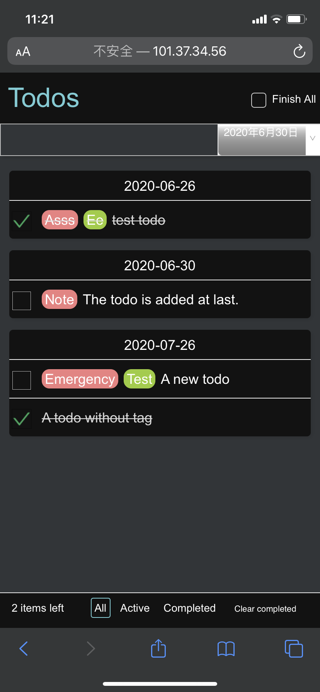
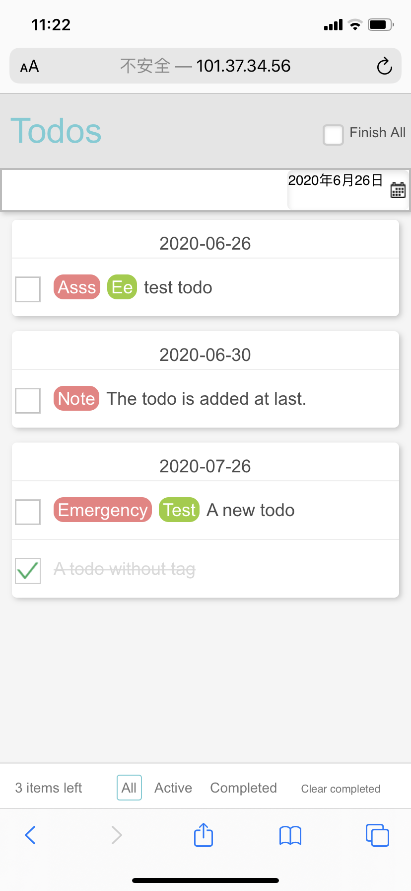
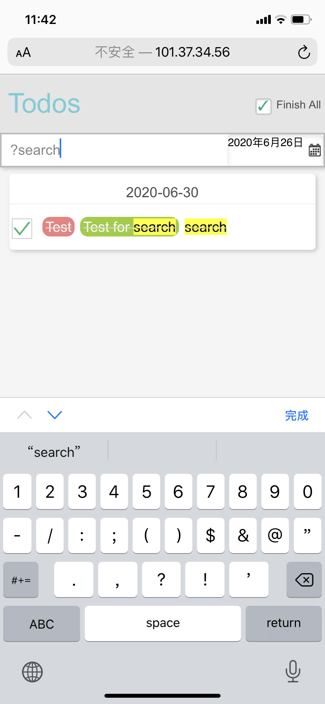

# Mobile-todoMVC
Script Programming, Spring 2020, School of Software Engineering, Tongji University. Shanghai.

Visit: http://101.37.34.56

## 功能实现

### 基本功能

1. 新增 `Todo` 

    用户在界面上方的 Input Field 中输入 `todo` 信息后，敲击回车，在 iOS 设备上为点击换行即可插入新的 `todo`

2. 删除 `Todo`

    用户可以通过左右滑动单条 `todo` 来删除一条 `todo` 信息

3. 展示列表

    用户每新添加或删除 `todo` 时，会在页面上及时反馈

4. 全部完成/取消

    用户点击界面上方的 `Finish All` 按钮即可

5. 删除已完成

    当部分 `todo` 项目为已完成状态，底部会显示 `Clear completed` 按钮，点击即可删除已完成项目

6. 单条 `todo` 项目状态切换

    用户可以点击未完成状态 `todo` 项目左侧的选框来完成使 `todo` 项目的状态为已完成，反之亦然。

### 高级功能

1. 过滤 (`All`, `Active`, `Completed`)
  

用户可以通过选择下方的 `filter` 类型来对当前的 `Todo` 项目进行过滤；
    
2. 编辑单条 `todo`

    双击一条 `todo` 即可对它进行编辑（注：在 Chrome 的手机模拟器中模拟不出双击的操作，但在 iOS 设备上测试有效）

3. 保存页面状态

    使用 localStorage 来保存数据。（注：仿照 HTTP Request Methods 中的 RESTful API 实现了 PUT, POST, GET, DELETE 接口）

4. 设置 todo deadline

    在 input field 边上有个选择 Deadline 日期的 `Date Picker`，可为 `todo` 项目设置一个deadline，并且下方依据 deadline 的远近来排列组合 `todo`

5. 为 `todo` 设置自选 Tag

    用户在输入 todo 时，只需在输入关键词后再输入一个逗号，即可自动生成一个 Tag （用不同的颜色显示区别），下方的列表也会显示 Tag.

6. 文字过滤（搜索 + 高亮关键词）

    在上方的 input field 中输入以英文 `?` 开头的字符后，敲击回车，即可实现搜索功能（搜索对大小写不敏感，可以搜 Tag 或 `todo` 文本中的关键词），相应的关键词也会高亮

7. 黑暗模式

    读取浏览器/系统主题颜色 `prefers-color-scheme`，并以此来切换黑暗模式/普通模式。

##  设计亮点

1. 用户可以输入自选的关键词（用逗号分离并自动标注关键词，关键词高亮），可以醒目地看到一些重要的信息；相比于高/中/低紧急程度的关键词，自选的关键词有更强的灵活性；
2. 用户可以搜索 todo 列表中的文字（包括 todo 文本和 tag ），使用了正则表达式进行搜索，并且匹配的特征词高亮显示使用 `string.replace()` 来添加高亮的 `` ；从而可以快速定位到重要的信息；
3. 以上两个功能都是只在一个输入框中实现的，考虑到手机的屏幕大小有限，在页面上添加太多的功能组件会影响到用户的体验，因此我尝试了对一个组件进行功能的复用；
4. 考虑到移动端用户使用的便捷性，使用了左滑/右滑删除的交互方式；
5. 仿照着移动端 APP 的设计方式，将底部的 filter 和顶部的 header 固定，方便移动端用户即便在添加了很多todo项目后仍能快速地定位到相关的 filter 和输入框；
6. 为 todo 添加一个 deadline ，并按 deadline 时间的远近来排列 todo，以此来让用户更明确要紧的项目；
7. `tags-input.js` 中定义了一个 self-invoking function（在我理解看来应当算是一个 Class），实现了输入 Tag并分离 Tag 和普通文本的功能，网页中的输入框以及下面的每条可编辑的 todo 信息均为其实例化，实现了即使功能差异较大的组件也能复用相同的代码；

## 参考的材料

- Tags input 借鉴了 https://codepen.io/juliendargelos/details/MJjJZm
- 参考了大量 Stackoverflow, stackExchange 之类的论坛

## 功能演示

1. 两种配色模式（注：深色模式我没有做适配，部分布局跟浅色模式不一致，所以建议老师测试的时候将电脑或者手机调成浅色模式）

    <table>
        <tr>
            <td></td>
            <td></td>
        </tr>
    </table>

2. 其他内容都在 demo 视频里，这里展示一下搜索功能

    
